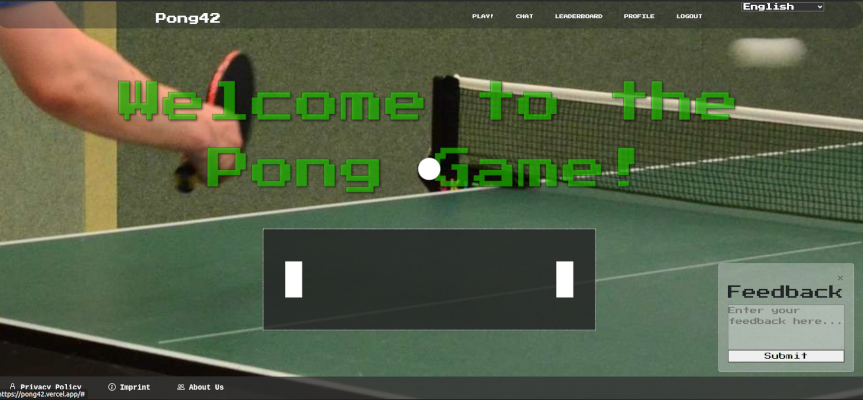

# Pure JavaScript Frontend with Django Backend

## Team:

Deyan: [ddyankov](https://github.com/ddyankov28)
Ehab: [eelasam](https://github.com/EhabElasam)
Hüseyin: [huaydin](https://github.com/hu8813)
Valentin: [vstockma](https://github.com/vstockma)


## 🏓 42 Transcendence: Pong42 Project 🏓

Welcome to **Pong42**, a school project **42 Transcendence**. This project features a combination of a **Django backend** and a **pure JavaScript (vanilla JS) frontend**. 




### Production Setup 

Frontend & Postgresql Db are hosted on Vercel (free), Backend is hosted on Azure as WebApp, could also be hosted on Render (free)

### Key Features of 42 ft_transcendence Project

- **Django Backend**: Robust and scalable backend developed using the Django framework.
- **Vanilla JavaScript Frontend**: Clean and efficient frontend built with pure JavaScript.

### Project Overview for 42 transcendence

Pong42 is designed to demonstrate the capabilities of integrating a Django backend with a vanilla JavaScript frontend.

### Installation and Setup for Pong42

To get started with Pong42, follow these steps:

1. **Clone the Repository**:
    ```bash
    git clone https://github.com/hu8813/42_ft_transcendence.git pong42
    cd pong42
    ```

2. **Create .env file**:
    just rename sample.env to .env and use it as Reference

3. **Run**:
    ```bash
    make
    # OR
    docker compose up
    ```

### Live Demo of 42 Transcendence Project

Check out the live demo of the **Pong42** project: [Pong42 Website](https://pong42.vercel.app)

### Keywords

- Django backend
- Vanilla JavaScript
- Pure JS frontend
- ft_transcendence project
- 42 Transcendence
- Real-time web application
- Responsive web design

---

Enhance your web development skills with the leveraging the power of **Django** and **vanilla JavaScript** to create a dynamic and responsive web application as part of the **42 Transcendence** course.
